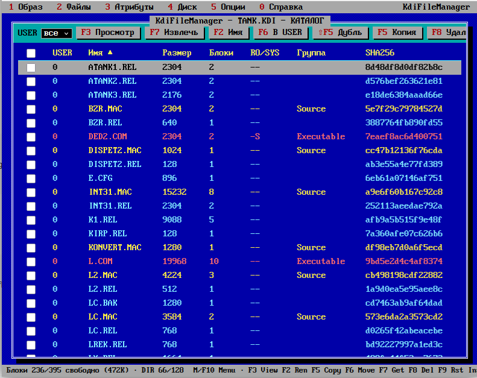

# KdiFileManager — менеджер файлов образов дисков Корвет

## НАЗВАНИЕ

**KdiFileManager** — браузерный менеджер файлов для образов дисков (KDI) компьютера Корвет (CP/M-80 v2.2).



## ОБЗОР

**KdiFileManager** — это одностраничное веб-приложение (HTML + JavaScript), предназначенное для просмотра, редактирования и управления содержимым образов дискет формата **KDI**, используемых в советском учебном компьютере **Корвет ПК8020** под управлением **CP/M-80 версии 2.2**.

Программа работает полностью в браузере, не требует установки и не передаёт данные на сервер. Образы дисков загружаются через файловый интерфейс браузера или перетаскиванием.

## СИНТАКСИС

Откройте файл `KdiFileManager.html` в современном браузере. Через меню **Образ → Новый образ…** или **Образ → Открыть образ…** загрузите файл `.kdi`.

## ОПИСАНИЕ

### Формат KDI

Формат **KDI** (Korvet Disk Image) представляет собой посекторную копию дискеты без контейнерной обёртки. Образ начинается с 32-байтовой структуры **DSKINFO**, которая содержит параметры геометрии диска и **блок параметров диска (DPB)** в формате CP/M 2.2.

Ключевые параметры DSKINFO включают:

| Смещение | Поле | Назначение |
|----------|------|------------|
| 0–1 | LoadAddr | адрес загрузки системного трека |
| 2–3 | RunAddr | адрес запуска после загрузки |
| 4–5 | Count | число физических секторов для загрузки |
| 6–15 | геометрия | тип дискеты, плотность, число дорожек и секторов |
| 16–30 | DPB | SPT, BSH, BLM, EXM, DSM, DRM, AL0, AL1, CKS, OFS |
| 31 | CRC | контрольная сумма `(0x66 + Σ байт 0..30) & 0xFF` |

Подробное описание полей DSKINFO и структуры каталога CP/M 2.2 приведено во встроенной справке.

### Функциональность

- **Каталог** — таблица файлов с колонками USER, имя, размер, блоки, атрибуты R/O и SYS, группа, SHA-256.
- **Карта диска** — визуальное представление занятости блоков: системная область, каталог, свободные блоки, файлы, корзина и кросс-линки.
- **DSKINFO** — просмотр и редактирование полей информационного сектора с проверкой согласованности.
- **Просмотр файлов** — встроенные просмотрщики:
  - **HEX/ASCII** — шестнадцатеричный и текстовый режимы с редактированием;
  - **BASIC** — декодер токенизированных программ MBASIC (файлы с сигнатурой `0xFF`).
- **Извлечение на хост** — сохранение файлов с диска на локальный компьютер.
- **Добавление файлов** — запись файлов с хоста в образ; имена автоматически приводятся к формату 8.3 с транслитерацией кириллицы.
- **Переименование, удаление, восстановление** — стандартные файловые операции с учётом специфики каталога CP/M.
- **Управление USER** — фильтрация и перемещение файлов между пользовательскими областями (0–255).
- **Системный трек** — загрузка и сохранение системной области, замена системного трека с автоматическим пересчётом DSM и OFS.
- **Проверка каталога** — поиск кросс-линков, битых указателей, пропусков экстентов и «сиротских» блоков.

### Клавиатурные сокращения

| Клавиша | Действие |
|---------|----------|
| `M` / `F10` | Меню |
| `F1` | Справка |
| `F2` | Переименовать |
| `F3` / `Enter` | Просмотр |
| `F5` / `Shift+F5` | Копировать / дублировать |
| `F6` | Переместить в USER |
| `F7` | Извлечь |
| `F8` | Удалить |
| `F9` | Восстановить |
| `Ins` | Добавить файлы с хоста |
| `Space` | Отметить файл |
| `+` / `-` / `*` | Отметить все / снять / инвертировать |
| `Ctrl+A` | Отметить все |
| `U` | Цикл фильтра USER |
| `S` / `Shift+S` | Цикл сортировки / обратный порядок |
| `Shift+F10` | Контекстное меню |

### Кодировки

Программа поддерживает две кодовые страницы: **KOI8-R** (по умолчанию) и **CP866**. Переключение — через меню **Опции → Кодировка** или клавишу **F8** в просмотрщике.

## ПРИМЕРЫ

**Открыть образ:**
```
Меню → Образ → Открыть образ… → выбрать файл .kdi
```

**Извлечь все файлы:**
```
Ctrl+A → F7
```

**Добавить файлы с хоста:**
```
Ins → выбрать файлы → OK
```

**Просмотреть текстовый файл:**
```
F3 → F3 (переключение в ASCII)
```

## ФАЙЛЫ

`KdiFileManager.html` — единственный файл приложения. Не требует внешних зависимостей, кроме браузера с поддержкой JavaScript и Web Crypto API.

## ДИАГНОСТИКА

Программа выполняет проверки согласованности образа:

- **CRC DSKINFO** — при несовпадении контрольной суммы предлагается игнорировать или прервать загрузку.
- **Геометрия** — проверка соответствия SPT, EXM, CKS формулам CP/M и размерам образа.
- **Каталог** — обнаружение кросс-линков, дублирующихся экстентов, пропусков, указателей за пределами RC и неиспользуемых указателей.
- **Свободное место** — проверка достаточности свободных блоков и входов каталога перед записью.

## ОШИБКИ

| Сообщение | Причина |
|-----------|---------|
| `Ошибка CRC в DSKINFO` | Несовпадение контрольной суммы информационного сектора |
| `Неверная геометрия образа` | Некорректные параметры DSKINFO или несоответствие размеру файла |
| `Нет места` | Недостаточно свободных блоков для записи файла |
| `Нет свободных входов каталога` | Все 32-байтовые записи каталога заняты |
| `Такой файл уже есть` | Конфликт имён при переименовании или копировании |
| `Блоки заняты другими файлами` | Попытка восстановить файл поверх занятых блоков |

## ЛИЦЕНЗИЯ

Программа распространяется под лицензией **Zero-Clause BSD (0BSD)**.

Лицензия **0BSD** не требует сохранения уведомления об авторских правах и является одной из самых свободных лицензий, функционально эквивалентной передаче в общественное достояние. Она одобрена OSI и совместима с GPL.


```
Permission to use, copy, modify, and/or distribute this software for any
purpose with or without fee is hereby granted.

THE SOFTWARE IS PROVIDED "AS IS" AND THE AUTHOR DISCLAIMS ALL WARRANTIES
WITH REGARD TO THIS SOFTWARE INCLUDING ALL IMPLIED WARRANTIES OF
MERCHANTABILITY AND FITNESS. IN NO EVENT SHALL THE AUTHOR BE LIABLE FOR
ANY SPECIAL, DIRECT, INDIRECT, OR CONSEQUENTIAL DAMAGES OR ANY DAMAGES
WHATSOEVER RESULTING FROM LOSS OF USE, DATA OR PROFITS, WHETHER IN AN
ACTION OF CONTRACT, NEGLIGENCE OR OTHER TORTIOUS ACTION, ARISING OUT OF
OR IN CONNECTION WITH THE USE OR PERFORMANCE OF THIS SOFTWARE.
```

## АВТОР

Автор: [github.com/reclaimed](https://github.com/reclaimed)

Проект: [github.com/reclaimed/KdiFileManager](https://github.com/reclaimed/KdiFileManager)

## ИСТОРИЯ

Программа создана на основе формата DSKINFO и алгоритмов, описанных в утилите **xKorvet** (Sergey Erokhin, 2002–2003). Формат DSKINFO соответствует структуре дисков CP/M-80 v2.2, использовавшейся на компьютере Корвет (НИИЯФ МГУ, 1988).

Шрифт: **Classic Console Neue** (© DeeJayy 2011–2025, MIT License, встроенное подмножество).

Таблица токенов MBASIC: [fileformats.archiveteam.org](https://fileformats.archiveteam.org).

## СМ. ТАКЖЕ

- [CP/M 2.2 Alteration Guide, Chapter 6](https://www.icl1900.co.uk/unix4fun/z80pack/cpm2/ch6.htm)
- [seasip.info — CP/M 2.2 Disk Formats](https://www.seasip.info/Cpm/format22.html)
- [Корвет (компьютер) — Википедия](https://ru.wikipedia.org/wiki/Корвет_(компьютер))
